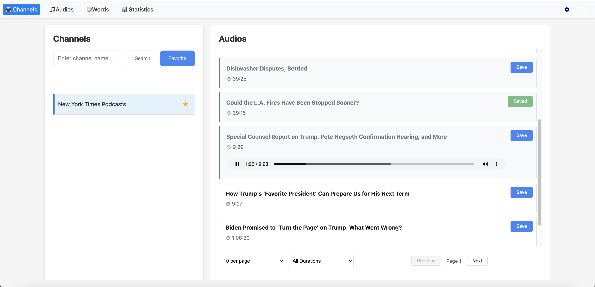
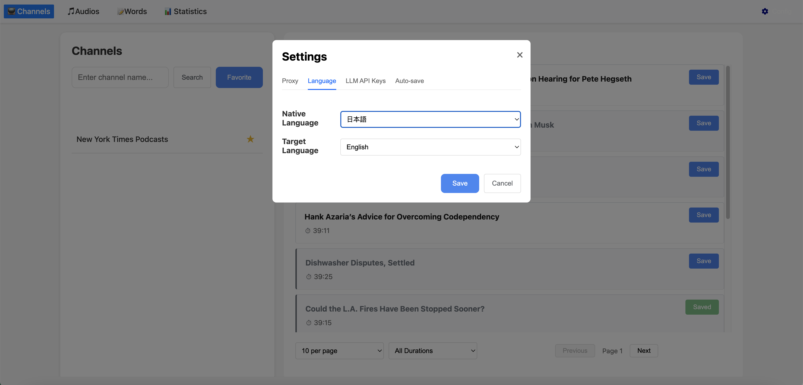
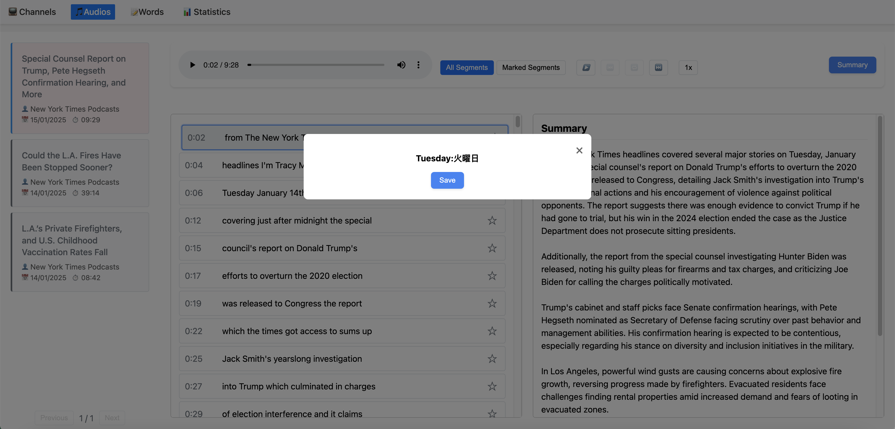

# YouAudio

This desktop application helps language learners practice their listening comprehension skills using audio and transcripts from YouTube videos.

## Supported Platforms
YouAudio supports both Windows and macOS platforms.

## Architecture
The application utilizes a web page as the front-end and Python scripts as the backend.

- The `python` subdirectory contains the backend implementation.
- The `YouAudioTray` subdirectory is a system tray application for Windows that creates a system tray icon and invokes Python scripts and the default web browser to access the backend.

## LLM Services
This project supports HTTP access to three LLM (Language Learning Model) services for word translation, OpenAi, Tencent Hunyuan, and Alibaba Qianwen. Users can add the corresponding API keys via the settings page, to enable translation capabilities within the application.

## Application Snapshots
Here are some snapshots of the application in action:





## Building the Application

### For macOS
1. Install ffmpeg on your macOS machine and change the path in the `youaudio.spec` file.
2. Navigate to the `python` directory.
3. Execute the following command to build the macOS app:
   ```bash
   pip install -r requirements.txt
   pyinstaller youaudio.spec
   ```
   The built application will be located in the `dist` subdirectory.
4. Double-click the `YouAudio.app` to run the application. The default web browser will open and vist http://localhost:9527.

### For Windows
#### Backend
1. Navigate to the `python` directory.
2. Execute the following command to build the Windows application:
   ```bash
   pip install -r requirements.txt
   pyinstaller youaudio.spec
   ```
   This will create `youaudio.exe` and an `_internal` directory containing the necessary support files for the application.
3. Double-click the `youaudio.exe` to run the application. 
4. Launch web browser and vist http://localhost:9527.

#### System Tray
1. Load the project inside directory of YouAudioTray with QtCreator.
2. Build the project, the `YouAudioTray.exe` will be generated.
3. Copy the `youaudio.exe` and `_internal` directory to the directory containing 'YouAudioTray.exe'.
4. Double-click 'YouAudioTray.exe' to run the application.

## Acknowledgements
This project utilizes the open-source `yt-dlp` project for downloading YouTube content. Special thanks to the contributors of [yt-dlp](https://github.com/yt-dlp/yt-dlp) for their valuable work.
Most of the code was generated by WindSurf.
